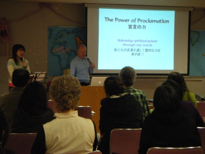

---
# An instance of the Blank widget.
# Documentation: https://sourcethemes.com/academic/docs/page-builder/
widget: blank

# Activate this widget? true/false
active: true

# This file represents a page section.
headless: true

# Order that this section appears on the page.
weight: 31

title: Know God more.
subtitle: Lecture Phase

design:
  columns: "2"

  #spacing:
  #  padding: ["20px", "0", "20px", "0"]

---

**The Discipleship Training School (DTS) lecture phase provides classroom learning, community-bonding, and heart change. It’s a chance to have your perspectives altered and your view of God deepened.**

# Class

Lecture phase engages the mind. It usually occurs onsite at a YWAM centre, and lasts eleven to twelve weeks. You will receive powerful teaching from motivating speakers and missionaries, meant to provoke, challenge, and encourage. Issues like hearing the voice of God, identity, sin and forgiveness, and much more are discussed. Classroom time is a chance to build friendships and dig deeper into the questions we all have.

# Practical Work

A key part of character development is serving those around us. A part of DTS is working to keep the YWAM community functioning, while teaching teamwork and dedication. Whether it is gardening, cleaning, reception, or something else, this side of DTS helps you become a part of the community of YWAM around you.

# Small Groups and One-On-One

Perhaps one of the most important parts of DTS is small groups and one-on-one discipleship. These times will allow you to process what you’re learning about God in a safe environment. One-on-ones are usually held with a DTS staff member, someone who is with you throughout the entire lecture phase. It is their goal to help you grow through mentorship and counsel.

Small groups are held with other DTS students. Here, you can see how your other classmates are being challenged as well. With discussions and personal input into what you’re learning, these are not only times to get to know your classmates better, but also a time to experience the change in others.

# Local Ministry/Outreach

Personal transformation leads to the transformation of community. You will have a chance to make a difference in the surrounding society through ministry and mini-outreaches. Whether it’s teaching the gospel, working on a community project, or praying for the town or city, your DTS staff will guide you every step of the way, equipping you to impact a neighbourhood.

This kind of local ministry will also form part of your preparation for the DTS outreach phase.
